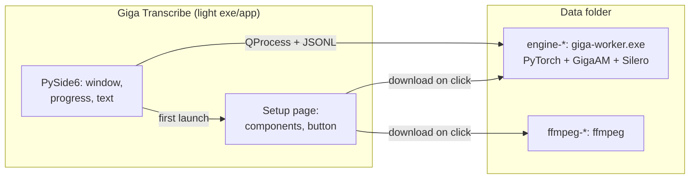
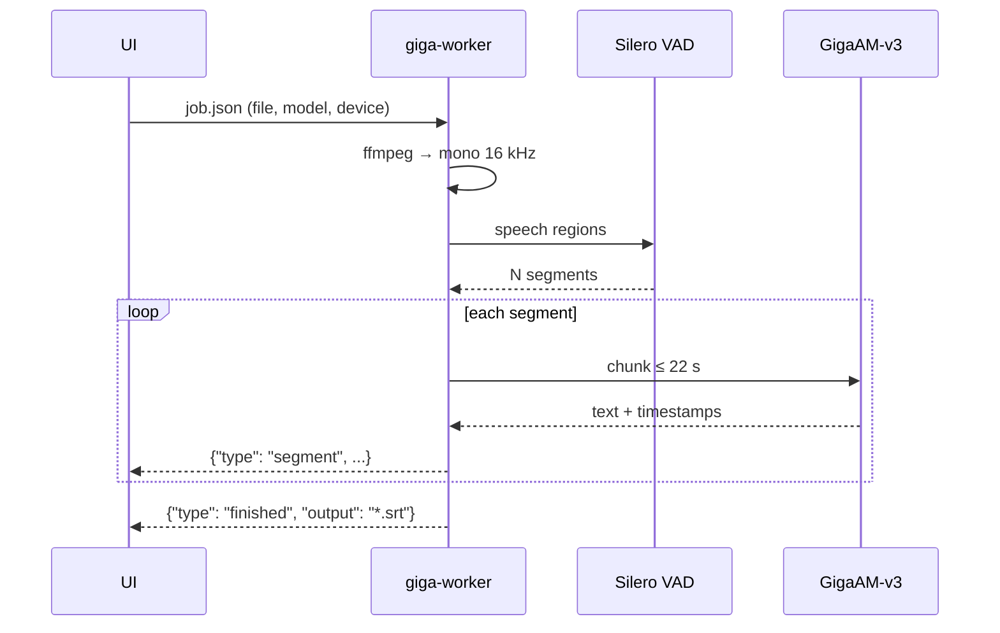
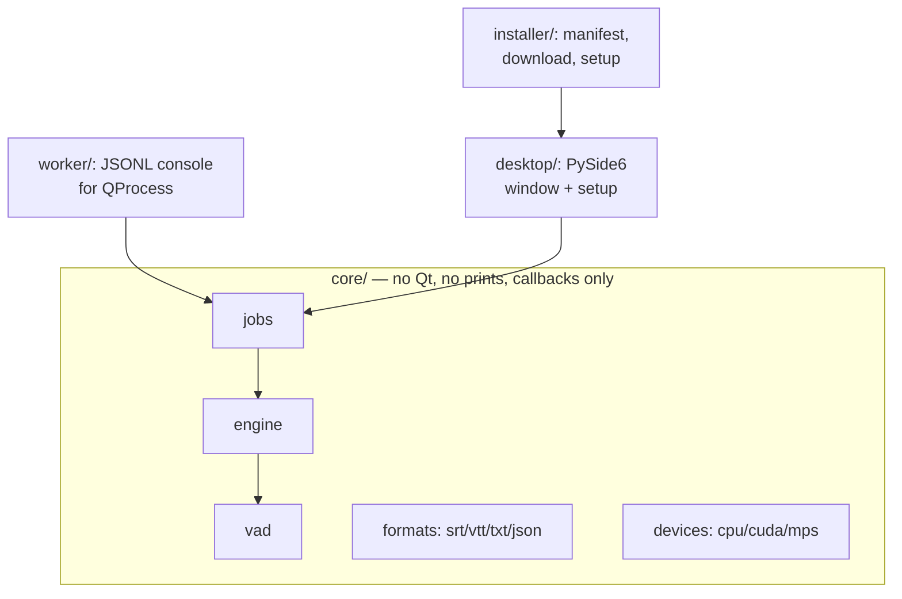
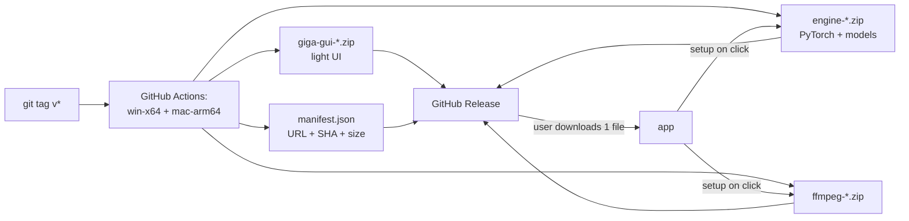

# Giga Transcribe

> 🇷🇺 Читать на русском: [README.ru.md](README.ru.md)

Desktop app for speech-to-text on audio and video.
Local, no cloud: GigaAM-v3 model + Silero VAD, Windows and macOS Apple Silicon.

- 🎙️ Audio and video (wav, mp3, mp4, mkv and more — ffmpeg handles it all)
- 📝 Subtitle output: SRT, VTT, TXT, JSON
- 🖥️ CPU everywhere; NVIDIA CUDA and Apple Metal (MPS) where available
- 📦 Light exe/app: the heavy engine downloads itself on first launch, on button press
- 🔒 Audio never leaves your machine — everything runs locally

## Quick start (users)

1. Download **one file** from [Releases](https://github.com/kwexz/isMemory/releases):
   `GigaTranscribe-Windows.zip` or `GigaTranscribe-macOS.zip`.
2. Unpack, run `giga-gui` (`giga-gui.exe` on Windows).
3. On the setup page press **"Download and install"** —
   the app shows the contents and total size up front
   (engine ~300–400 MB, FFmpeg, speech models).
4. Open or drag & drop a file, press **"Transcribe"**.

> Builds are not code-signed yet: SmartScreen / Gatekeeper will show
> a warning (macOS: right-click → Open).

## How it works



Transcribing one file:



## Run from source (developers)

```bash
python -m venv .venv && .venv/Scripts/activate   # Windows
pip install -e .          # dependencies from pyproject.toml
pip install pytest PySide6  # tests and GUI

# console
PYTHONPATH=src python -m giga_transcribe "input/call.wav" --format srt

# GUI
PYTHONPATH=src python -m giga_transcribe.desktop.app
```

Requirements: Python 3.12, ffmpeg on PATH. No HF token needed
(VAD is Silero, no gated models in the pipeline).

## Checks

```bash
PYTHONPATH=src pytest tests -q          # all tests (mocks, no model)
QT_QPA_PLATFORM=offscreen pytest tests/test_desktop.py  # headless GUI
```

End-to-end engine check — `input/short.wav` (local file, never committed):
7 segments, SRT byte-stable across CPU/GPU.

## Layout



- `core/` — engine: model loading, VAD chunking, inference, cancel between chunks.
- `worker/` — same engine as a separate process (JSONL on stdout).
- `desktop/` — window, first-run setup page, QThread/QProcess workers.
- `installer/` — component manifest, resumable SHA-256 downloads, install marker.
- `packaging/` — PyInstaller specs; `.github/workflows/release.yml` — releases.

## Releases and setup



## Privacy

- Audio and transcripts are processed locally only.
- Never committed: audio, subtitles, tokens, models (see `.gitignore`).
- `input/` holds local files for manual runs only.
- Component licenses and sources: [THIRD-PARTY-NOTICES.md](THIRD-PARTY-NOTICES.md).

## Status and plans

Done: core, CLI, GUI, on-click setup, win/mac engine packs, MPS on Apple Silicon,
v0.1.x releases.

Next: file queue, CUDA engine pack (needs hardware to verify),
speaker diarization, auto-updates.
See `AGENTS.md` — skill routing and architecture boundaries.
