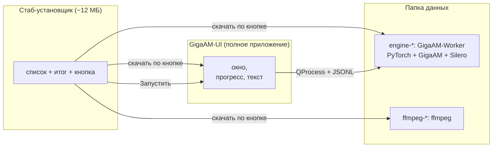
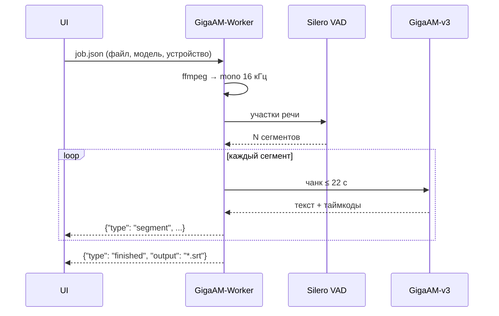
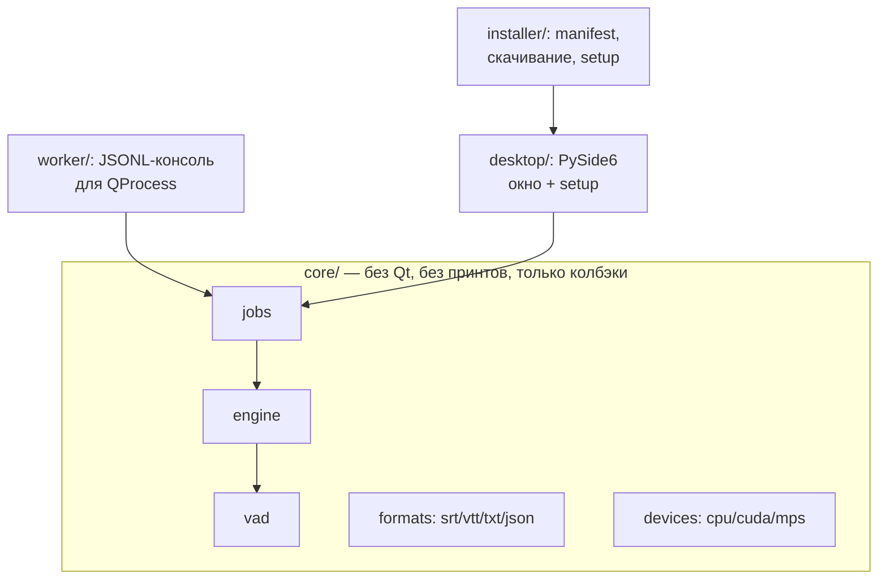
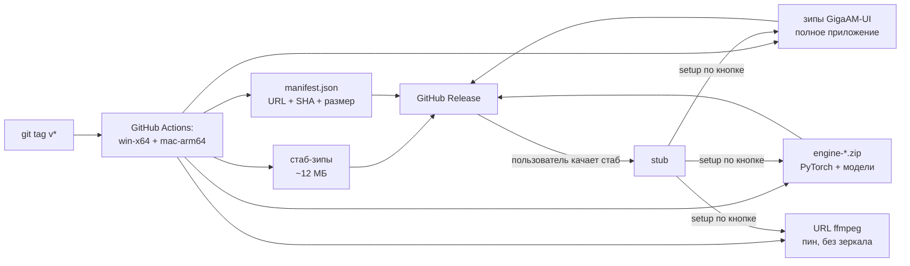

# Giga Transcribe

> 🇬🇧 Read in English: [README.md](README.md)

Десктопное приложение для распознавания аудио и видео в текст.
Локально, без облаков: модель GigaAM-v3 + Silero VAD, Windows и macOS Apple Silicon.

- 🎙️ Аудио и видео (wav, mp3, mp4, mkv и др. — всё тянет ffmpeg)
- 📝 Субтитры на выходе: SRT, VTT, TXT, JSON
- 🖥️ CPU везде; NVIDIA CUDA и Apple Metal (MPS) — где есть
- 📦 Лёгкий exe/app: тяжёлый движок докачивается сам при первом запуске, по кнопке
- 🔒 Аудио никуда не отправляется — всё считается на вашем компьютере

## Быстрый старт (пользователю)

1. Скачайте крошечный установщик со страницы [Releases](https://github.com/kwexz/isMemory/releases):
   `GigaTranscribe-Setup-Windows.zip` или `GigaTranscribe-Setup-macOS.zip` (~12 МБ).
2. Распакуйте, запустите, нажмите **«Скачать и установить»**,
   затем **«Запустить»**.
3. Откройте или перетащите файл, нажмите **«Распознать»**.

Нужна ручная установка? `GigaTranscribe-Windows.zip` / `-macOS.zip` — полное
приложение (`GigaAM-UI`) со своей setup-страницей для движка и FFmpeg.

> Сборки пока без цифровой подписи: SmartScreen / Gatekeeper покажут
> предупреждение (macOS: правый клик → Открыть).

## Как это устроено



Распознавание одного файла:



## Запуск из исходников (разработчику)

```bash
python -m venv .venv && .venv/Scripts/activate   # Windows
pip install -e .          # зависимости из pyproject.toml
pip install pytest PySide6  # тесты и GUI

# консоль
PYTHONPATH=src python -m giga_transcribe "input/call.wav" --format srt

# GUI
PYTHONPATH=src python -m giga_transcribe.desktop.app
```

Нужны: Python 3.12, ffmpeg в PATH. HF-токен **не нужен**
(VAD — Silero, gated-моделей в тракте нет).

## Проверки

```bash
PYTHONPATH=src pytest tests -q          # все тесты (моки, без модели)
QT_QPA_PLATFORM=offscreen pytest tests/test_desktop.py  # GUI без экрана
```

Сквозная проверка движка — `input/short.wav` (локальный файл, в репозиторий
не коммитится): 7 сегментов, SRT побайтово стабилен между CPU/GPU.

## Структура



- `core/` — движок: загрузка модели, VAD-чанкинг, инференс, отмена между чанками.
- `worker/` — тот же движок как отдельный процесс (JSONL по stdout).
- `desktop/` — окно, setup-страница первого запуска, QThread/QProcess-воркеры.
- `installer/` — манифест компонентов, докачка с resume + SHA-256, маркер установки.
- `packaging/` — PyInstaller-спеки; `.github/workflows/release.yml` — релизы.

## Релизы и установка



## Приватность

- Аудио и транскрипты обрабатываются только локально.
- В репозиторий не коммитятся: аудио, субтитры, токены, модели (см. `.gitignore`).
- Папка `input/` — только локальные файлы для ручных прогонов.
- Лицензии и источники компонентов: [THIRD-PARTY-NOTICES.md](THIRD-PARTY-NOTICES.md).

## Статус и планы

Готово: ядро, CLI, GUI, setup по кнопке, engine-паки win/mac, MPS на Apple Silicon,
релизы v0.1.x.

Дальше: очередь файлов, CUDA engine-pack (нужно железо для проверки),
диаризация со спикерами, автообновления.
См. `AGENTS.md` — маршрутизация скиллов и границы архитектуры.
